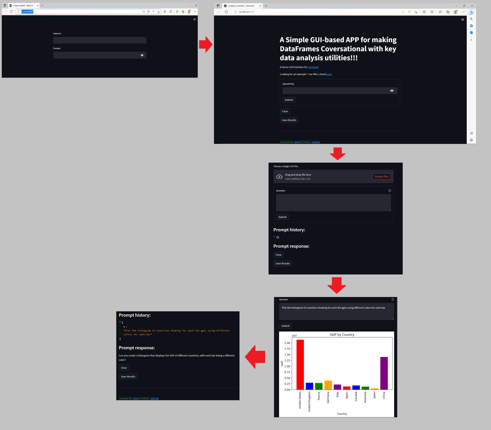
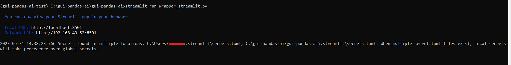
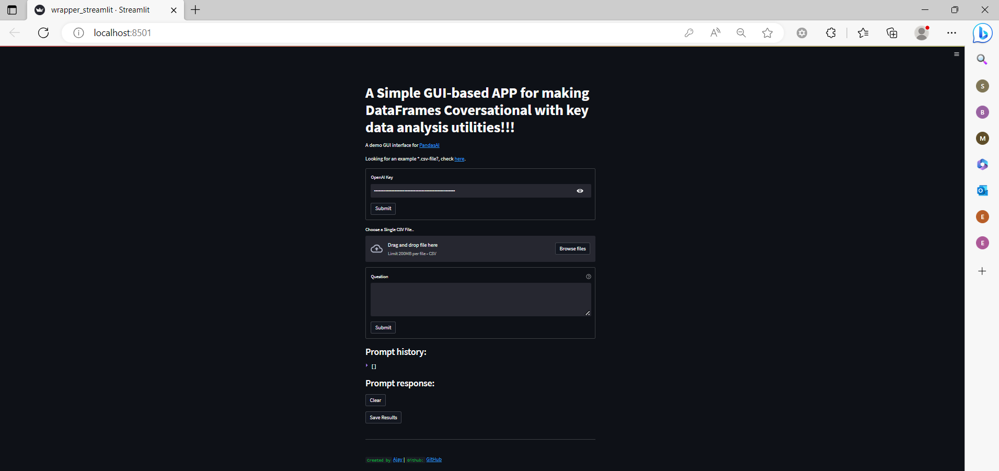

`GUIPandasAI`: An open-source, low-code python application with Generative AI capabilities using Streamlit for in-depth conversational data analysis bundled with key additional data functionalities using simple plain key-words
===============================================================================================================================================================

`gui-pandas-ai` is concieved, designed and developed by `Ajay Arunachalam` (ajay.arunachalam08@gmail) - https://www.linkedin.com/in/ajay-ph-d-4744581a/ 

**gui-pandas-ai**

pypi: https://pypi.org/project/gui-pandas-ai


The complete APP workflow is summarised as seen below.



The users after sucessful login, are redirected to the API key input window to submit their respective openAI key. Next, the users can upload their flat csv file followed by their data analysis queries. The history of the prompts and responses can also be stored in the text file, along with provision to save the plots. Simply, one can ask questions about your data and get the answers back, in the form of human natural language response. 


About `GUIPandasAI`
===================

`gui-pandas-ai` is a simple, ease-to-use Python UI Wrapper built to use `PandasAI` as naively and intuitively as possible. `gui-pandas-ai` provides an easy web gui interface to access `ChatGPT` directly along with provision for several key data analysis utilities. It is altogether a `low-code` solution. With this utility APP one can perform all end-to-end data analysis simply with text-based input queries democratizing Generative AI functionalities. User's can simply ask question related to their data and get the corresponding analysis as response. Further, one can also get quick insights, explore trends & patterns, get the aggregated results, fetch data profiling report and data summary, rendered SQL view of data for offline SQL analysis, data storytelling extract, etc.  

GUIPandasAI Usage Steps
=======================
Step 1) Create a virtual environment

.. code:: bash
	
	py -3 -m venv <your_env_name>
	cd <your_env_name>/Scripts/activate
	
	**or**
	
	conda create -n <your_env_name> python=3.x (or 3.x)
	source activate <your_env_name>

Step 2) Create the clone of the repository in your created virtual environment

.. code:: bash

	git clone https://github.com/ajayarunachalam/gui-pandas-ai
	cd gui-pandas-ai
	pip install -r requirements.txt

	**or**
	
	git clone https://github.com/ajayarunachalam/gui-pandas-ai
	cd gui-pandas-ai sudo bash setup.sh

	**or**

	git clone https://github.com/ajayarunachalam/gui-pandas-ai
 	cd gui-pandas-ai sudo bash setup.sh or sudo python setup.py install
	
Step 3) Launch APP

- **The users can set their own credentials in the file `secrets.toml` found under the folder `.streamlit`. Alternatively, one can also use the existing example credentials as-it-is which are `user_test` and `user@123` or `dev_test` and `dev@123`**

- **Windows users within the cloned folder just simply double-click the "run_app_windows.bat" file. Note:- Open the file with an Editor and replace with your virtual directory path within the file**

- **Linux users navigate within the cloned folder and type in "sudo bash run_app_linux.sh" in the terminal**

- **Mac users navigate within the cloned folder and type in "sh run_app_mac.sh" in the terminal**

- **Alternatively, we can also launch the APP by running the wrapper_streamlit.py file simply using the command “streamlit run wrapper_streamlit.py”**

The APP will launch with a URL as seen below.




APP Q&A Window 
==============
As seen below the user's can drag and drop their `CSV` files or upload them, and submit their questions in form of simple queries. The data analysis results are received back in the form of natural language. 



GUIPandasAI Code Snippet
========================
Below is the example code snippet that runs the LLMs while viewing the uploaded data.

.. code:: python

	if st.session_state.df is not None:
		st.subheader("Peek into the uploaded dataframe:")
	    st.write(st.session_state.df.head(2))

	with st.form("Question"):
		question = st.text_area("Question", value="", help="Enter your queries here")
	    answer = st.text_area("Answer", value="")
	    submitted = st.form_submit_button("Submit")
	    if submitted:
			with st.spinner():
				llm = OpenAI(api_token=st.session_state.openai_key)
		    pandas_ai = PandasAI(llm)
		    x = pandas_ai.run(st.session_state.df, prompt=question)

		    fig = plt.gcf()
		    fig, ax = plt.subplots(figsize=(10, 6))
		    plt.tight_layout()
		    if fig.get_axes() and fig is not None:
					st.pyplot(fig)
			fig.savefig("plot.png")
		    st.write(x)
		    st.session_state.prompt_history.append(question)
		    response_history.append(x)  # Append the response to the list
		    st.session_state.response_history = response_history
  

PandasAI - Overview
===================
`Pandas AI` is a Python library that adds generative artificial intelligence capabilities to Pandas, the popular data analysis and manipulation tool. `PandasAI` [PandasAI](https://github.com/gventuri/pandas-ai) aims to make Pandas dataframes conversational, allowing you to ask questions about your data and get answers back, in the form of natural human language. 

For quick overview glimse through the below illustration: (All Credits & Copyrights Reserved to `Pandas AI`)

.. code:: python
	import pandas as pd
	from pandasai import PandasAI

	# Sample DataFrame
	df = pd.DataFrame({
	    "country": ["United States", "United Kingdom", "France", "Germany", "Italy", "Spain", "Canada", "Australia", "Japan", "China"],
	    "gdp": [19294482071552, 2891615567872, 2411255037952, 3435817336832, 1745433788416, 1181205135360, 1607402389504, 1490967855104, 4380756541440, 14631844184064],
	    "happiness_index": [6.94, 7.16, 6.66, 7.07, 6.38, 6.4, 7.23, 7.22, 5.87, 5.12]
	})

	# Instantiate a LLM
	from pandasai.llm.openai import OpenAI
	llm = OpenAI(api_token="YOUR_API_TOKEN")

	pandas_ai = PandasAI(llm, conversational=True)
	pandas_ai(df, prompt='Which are the 5 happiest countries?')


The above code will return the following:

```
6            Canada
7         Australia
1    United Kingdom
3           Germany
0     United States
Name: country, dtype: object
```

Of course, you can also ask PandasAI to perform more complex queries. For example, you can ask PandasAI to find the sum of the GDPs of the 2 unhappiest countries:

.. code:: python
	pandas_ai(df, prompt='What is the sum of the GDPs of the 2 unhappiest countries?')


The above code will return the following:

```
19012600725504
```

.. code:: python
	"""Example of using PandasAI on multiple Pandas DataFrame"""

	import pandas as pd
	from pandasai import PandasAI
	from pandasai.llm.openai import OpenAI

	employees_data = {
	    'EmployeeID': [1, 2, 3, 4, 5],
	    'Name': ['John', 'Emma', 'Liam', 'Olivia', 'William'],
	    'Department': ['HR', 'Sales', 'IT', 'Marketing', 'Finance']
	}

	salaries_data = {
	    'EmployeeID': [1, 2, 3, 4, 5],
	    'Salary': [5000, 6000, 4500, 7000, 5500]
	}

	employees_df = pd.DataFrame(employees_data)
	salaries_df = pd.DataFrame(salaries_data)


	llm = OpenAI()
	pandas_ai = PandasAI(llm, verbose=True)
	response = pandas_ai([employees_df, salaries_df], "Who gets paid the most?")
	print(response)


```
# Output: Olivia
```

Collaboration
=============
Any contributions are most welcome! `GUIPandasAI` APP is still by large, work under progress. Please feel free to open a pull request.

License
=======
Copyright 2022-2023 Ajay Arunachalam <ajay.arunachalam08@gmail.com>

Permission is hereby granted, free of charge, to any person obtaining a copy of this software and associated documentation files (the "Software"), to deal in the Software without restriction, including without limitation the rights to use, copy, modify, merge, publish, distribute, sublicense, and/or sell copies of the Software, and to permit persons to whom the Software is furnished to do so, subject to the following conditions:

The above copyright notice and this permission notice shall be included in all copies or substantial portions of the Software.

THE SOFTWARE IS PROVIDED "AS IS", WITHOUT WARRANTY OF ANY KIND, EXPRESS OR IMPLIED, INCLUDING BUT NOT LIMITED TO THE WARRANTIES OF MERCHANTABILITY, FITNESS FOR A PARTICULAR PURPOSE AND NONINFRINGEMENT. IN NO EVENT SHALL THE AUTHORS OR COPYRIGHT HOLDERS BE LIABLE FOR ANY CLAIM, DAMAGES OR OTHER LIABILITY, WHETHER IN AN ACTION OF CONTRACT, TORT OR OTHERWISE, ARISING FROM, OUT OF OR IN CONNECTION WITH THE SOFTWARE OR THE USE OR OTHER DEALINGS IN THE SOFTWARE. © 2023 GitHub, Inc.

References
==========
Special mention to `streamlit`, `openai`, `PandasAI`, `Pandas Profiling` and the other open-source communities for their incredible contributions. 


TODO
====

- [ ] Include more LLMs
- [ ] Add support for Big Data
- [ ] Support for the different file formats
- [ ] Uploading Multiple flat files
- [ ] Add Statistical data analysis
- [ ] Add Adv. Data Analytics provision
- [ ] Integrate Lux based visualizations
